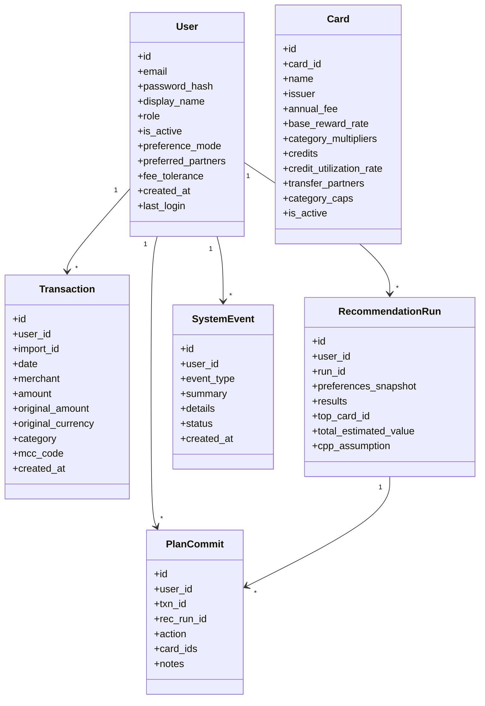

# Sprint 1 Status Report

## 1. GitLab Issues Opened/Closed
- Sprint 1 implementation covered authentication, ingestion, FX sync, category mapping, admin card catalog CRUD, dashboard, tests, and local docs artifacts.
- Engineering issues corresponding to GitLab items `#7` through `#16` are represented in the codebase and test suite.
- Documentation issues `#17` and `#18` are only partially complete where external human steps are required.

## 2. UML Class Diagram

## 3. Sprint Review
Sprint 1 turned the Sprint 0 scaffold into a usable application slice. Users can now register, log in, log out, upload CSV and JSON transactions, refresh FX rates, and reach a minimal authenticated dashboard. Admin users can manage the card catalog through dedicated CRUD routes.

## 4. Sprint Retrospective
The biggest implementation risk was keeping the scaffold simple while still satisfying the course acceptance criteria. Separating ingestion, FX, and event logging into services reduced route complexity and made the test suite more direct. The remaining gap is that a few documentation acceptance items still depend on TA review and course submission steps outside the repo.

## 5. Sprint Planning for Sprint 2
Sprint 2 should focus on the recommendation engine, current-data analysis screens, card value computation, and charts. The ingestion pipeline and admin card catalog are now strong enough to support recommendation development against seeded or imported data.

## 6. Additional Comments / Concerns
- The issue description references `prompts/SPRINT-STATUS-REPORT-TEMPLATE.md`, but that template file was not present in the repository at implementation time.
- TA prototype review and any Canvas submission steps still need to be completed manually.

