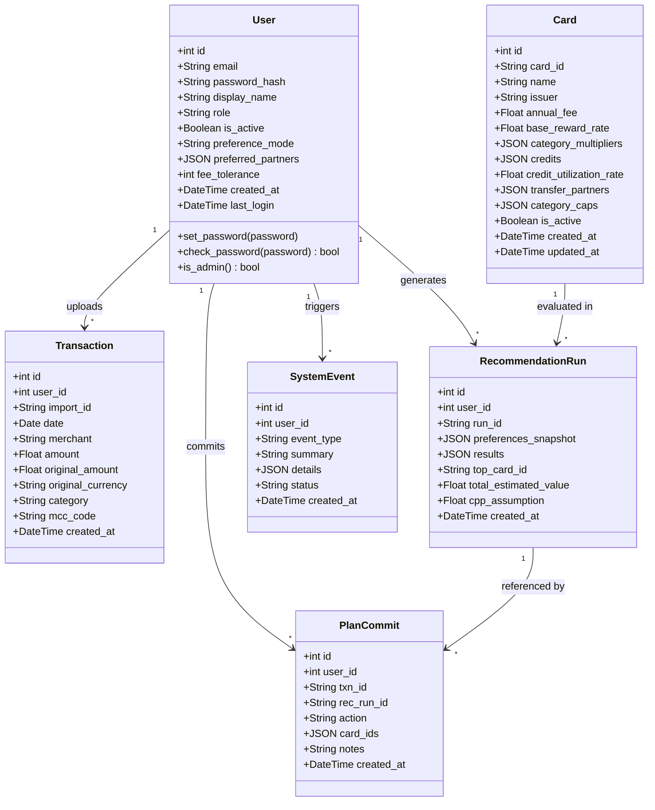

# Sprint [1] Status Report

**Team:** <pccrs>
**Project:** CardSmart — Personalized Credit Card Recommendation System
**Sprint Period:** <2026-03-01> – <2026-03-15>
**Report Date:** <2026-03-15>

---

## 1. GitLab Issues Summary

#1
Resolve HTTPS push authentication
closed
Resolved a 403 Forbidden error encountered when pushing to the remote repository via local Bash. The fix involved replacing the SSO password with a Personal Access Token (PAT) and correctly configuring the global user.name and user.email to associate the local environment with the school GitLab account.

#2
Local environment setup & Git hygiene
closed
Established a Python virtual environment (.venv) and configured a .gitignore file to prevent environment-specific files from being committed. This ensures the remote repository remains clean and free of unnecessary local artifacts.

#3
Sprint 1 requirements & status tracking
closed
Initiated the Sprint 1 status report workflow. The repository has been forked and initialized. System requirements are currently being identified and documented. A task board has been set up to track ongoing Prompt development progress throughout the sprint.

#4
Draft initial system design document
Responsible for producing the initial system architecture document. The primary focus is on defining the interaction logic between different functional modules and establishing clear boundaries for each component.

#5
Documentation proofreading & QA
open
A dedicated reviewer has been assigned to proofread all produced documents and Prompts. The goal is to verify logical consistency, accuracy, and alignment with project standards before final submission.

#6
Project scaffolding 
open
Initialize the Flask project structure (run.py, app factory, config, requirements, .env.example, .gitignore) and confirmed `python run.py` starts the dev server with config loaded from environment variables.

#7
SQLAlchemy models implemented
open
Created all core models (User, Transaction, Card, RecommendationRun, PlanCommit, SystemEvent) under `app/models/` and verified `flask db migrate` / `flask db upgrade` execute without errors.

#8
Blueprint stubs created
open
Added placeholder Blueprint routes for auth, dashboard, ingestion, analysis, plan, history, reporting, and admin, with each route returning a basic template and registered in the app factory.

#9
Base template + placeholder pages
open
Built `base.html` (Bootstrap + Plotly + auth-aware nav) and created placeholder templates for all major pages to ensure navigation and styling work end-to-end.

#10
Seed data tooling
open
Added seed data files (cards JSON, demo transactions CSV/JSON) and a `seed_db.py` script to populate the database with demo users and data, including the admin account (admin@cardsmart.com / admin123).

---

## 2. UML Class Diagram

---

## 3. Sprint Review

In Sprint 1, our team focused on project planning, work division, and establishing our development infrastructure. We set up our GitLab repository, created a branching strategy (feature branches merging into dev, then into main), and assigned each team member to a specific module: Hanqi Zou on authentication and models, Yuchen Zhou on data ingestion and API integration, Candice Ye on the recommendation engine, Yuxuan Fu on frontend templates and charts, and Anna Tu on admin functionality and DevOps. We also created a full project backlog of 47 GitLab issues across all sprints, with labels, milestones, and acceptance criteria defined for each. 

---

## 4. Sprint Retrospective

**What went well:** Creating the full GitLab issue backlog upfront gives everyone a clear picture of what needs to be done and when. The decision to use AI coding agents (vibe coding) for implementation was agreed upon by all members, and each person has set up their preferred tool.

**What didn't go well:** Some team members were unfamiliar with GitLab workflows, so we had to spend time on Git onboarding. We also started this sprint later than ideal, which compressed our planning window.

**Action items for next sprint:** (1) Begin implementation immediately — Person A will scaffold the project (Sprint 0 tasks) by the end of the first day so others can start coding on their feature branches. (2) Each member should complete their assigned Sprint 0 and Sprint 1 issues in parallel. 

---

## 5. Sprint Planning

For the next sprint, our goal is to complete all Sprint 0 (scaffolding) and Sprint 1 (authentication and data ingestion) implementation tasks.

---

